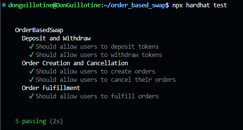
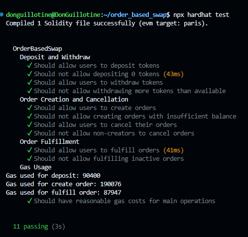

# Order-Based Swap Contract

This project implements an order-based token swap system using Solidity smart contracts. It allows users to deposit various ERC-20 tokens, create swap orders and fulfill orders created by other users.


## All tests passed



## I added additional test cases and scenarios



## Features

- Deposit and withdraw various ERC-20 tokens
- Create swap orders specifying the token to sell and the token to buy
- Fulfill orders created by other users
- Cancel active orders
- Gas-efficient operations
- Comprehensive test suite including fuzz testing

## Technologies Used

- Solidity ^0.8.24
- Hardhat
- Ethers.js v6
- OpenZeppelin Contracts
- Chai (for testing)

## Project Structure

```
.
├── contracts/
│   ├── OrderBasedSwap.sol
│   └── DoomEternalToken.sol
├── scripts/
│   ├── deploy.js
│   └── interact.js
├── test/
│   └── OrderBasedSwap.js
├── hardhat.config.js
└── README.md
```

## Setup

1. Clone the repository:
   ```
   git clone https://github.com/DonGuillotine/order_based_swap_contract.git
   cd order_based_swap_contract
   ```

2. Install dependencies:
   ```
   npm install
   ```

3. Create a `.env` file in the root directory and add your environment variables:
   ```
   ETHERSCAN_API_KEY=your_etherscan_api_key
   ALCHEMY_API_KEY=your_alchemy_api_key
   PRIVATE_KEY=your_wallet_private_key
   ```

## Usage

### Compile Contracts

```
npx hardhat compile
```

### Run Tests

```
npx hardhat test
```

### Deploy Contracts

To deploy to a local Hardhat network:

```
npx hardhat run scripts/deploy.js
```

To deploy to a specific network (e.g., sepolia testnet):

```
npx hardhat run scripts/deploy.js --network sepolia
```

## My Deployment

The smart contracts are deployed on the **Sepolia Testnet**. You can interact with the deployed contracts via a front-end or using Hardhat.

- **ERC20 Token Address**:
 - Warzone Token: https://sepolia.etherscan.io/address/0x8da7e2ddd0747b9e1924fA127E37F9B0d8866c31#writeContract
 - Vanguard Token: https://sepolia.etherscan.io/address/0xB73d126e1a62f0c1b26152292ceF917973f8a709#writeContract
- **OrderBasedSwap Contract Address**: https://sepolia.etherscan.io/address/0x3E9c1df6D9769423B82cd59724c8F6284193f684#writeContract

### Interact with Deployed Contracts

```
npx hardhat run scripts/interact.js --network sepolia
```

## Contract Verification

After deploying to a public network, verify your contract on Etherscan:

```
npx hardhat verify --network sepolia DEPLOYED_CONTRACT_ADDRESS
```

For `DoomEternalToken` contracts:

```
npx hardhat verify --network sepolia DUMMY_TOKEN_ADDRESS "Token Name" "TKN" "1000000000000000000000000"
```

## Main Contracts

### OrderBasedSwap

This is the main contract that handles the order-based swap functionality. It allows users to:

- Deposit and withdraw ERC-20 tokens
- Create swap orders
- Fulfill existing orders
- Cancel their own orders

### DoomEternalToken

A simple ERC-20 token implementation used for testing purposes. It allows:

- Minting tokens (restricted to the contract owner)
- Standard ERC-20 functionalities (transfer, approve, etc.)

## Testing

The project includes a comprehensive test suite that covers:

- Basic functionalities (deposit, withdraw, create order, fulfill order, cancel order)
- Edge cases and error conditions
- Gas usage reporting

Run the tests using:

```
npx hardhat test
```

## Security Considerations

- The contract uses OpenZeppelin's `SafeERC20` to handle token transfers safely.
- `ReentrancyGuard` is implemented to prevent reentrancy attacks.
- Access control is in place to ensure only authorized actions are performed.

## Contributing

Contributions are welcome! Please feel free to submit a Pull Request.

## License

This project is licensed under the MIT License.

## Disclaimer

This project is for educational purposes only. It has not been audited and should not be used in production without a thorough security review.
